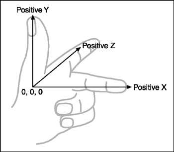

# Coding Conversion

## Naming

* File: FooBar.  // File name should be consistent with class name.

* Namespace: FooBar

* Class: FooBar

* Enum: FooBar

* Macro: FOO_BAR

* Constant:
  * Global/Class: FooBar
  * Local: foo_bar

* Variable
  * Global variable: g_foo_bar
  * Data member: foo_bar_
  * Local variable: foo_bar

* Function: FooBar

##Order: 

Principle: Let more important stuff be more front. Following are two examples using this principle.
  * public > protected > private
  * In public/protected, data > functions; Otherwise function > data.

## Format

We use Visual Studio 2015 default format style. It's nice! :]

## Prefix/Abbr.

* pos_: position

* vec_: vector

* dx_: DirectX interface or data only used for DirectX.

* len_: length

* cnt_: count

* w, v, p: world, view, projection

## Coordinate System

We use left hand coordinate system:

# DirectXMath/Platform/International

For color/position/matrix etc. we do not use storage class, we use only SSE type. The reason behind this is this way is easy, and workable on x64 systems. Also as a study project platform-supporting is not a really concern, this is the same reason why there is no plan to support non-Windows platform & non-Engish environments.

So we only support Windows x64 & English.

## Other

* Strive for simplicity. 

If two variable is enough, then not three; If you need only read it, then do not read+write it. This means we prefer access functions (getter) to directly access data member, and params/locals to data member. Data member is a source of mess, for it's easy to access in class, we should do our best to against this.

* Strive for abstraction.

This is a large topic, influence many things, I will mention some here:

1. As much as possible, do not write write implementation in header files, not even a simple return statement. Template functions should at least seperate its declaration and implementation, write its implementation at bottom of the file.
